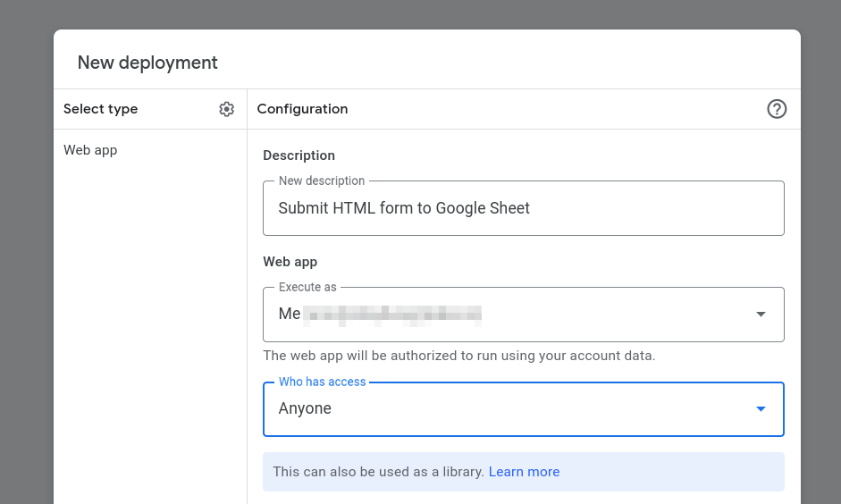

# Submit an HTML form to Google Sheets

This is a guide for submitting HTML forms to Google Sheets using HTML, Javascript (ES6), and Google Apps Script.

In the example below, we'll be creating an HTML contact form. The form can be placed on your website and, when submitted, will send the data to Google Sheets.

## 1. Create a Google Sheet

- Go to [Google Sheets](https://docs.google.com/spreadsheets) and under `Start a new spreadsheet`, select `Blank spreadsheet`
- Rename the spreadsheet to `Contact Form`
- In the first row, add the following columns:

| A | B | C | D |
|---|---|---|---|
| timestamp | name | email | message |

> Note: these column names will match the field names we use in our HTML form.

## 2. Create a Google Apps Script

- Click on `Extensions > Apps Script`
- Rename the project to `Submit Form to Google Sheet`
- Replace the code in `Code.js` with the provided code

The code to delete in `Code.js` looks like this:


```js
function myFunction() {
  
}
```

Replace it with this:
```js
// this is the name of the sheet tab at the bottom of the spreadsheet
const sheetName = "Sheet1";

function doPost(e) {
  // a catch for running in the editor
  if (e === undefined) return;

  // lock the sheet while we edit it
  let lock = LockService.getScriptLock();
  lock.tryLock(10000);

  // get Sheet1 on our spreadsheet
  let sheet = SpreadsheetApp.getActiveSpreadsheet().getSheetByName(sheetName);

  // grab our column headers (in row A1)
  let headers = sheet.getRange("A1").getDataRegion(SpreadsheetApp.Dimension.COLUMNS).getValues()[0];

  // take the user's input and map it to our headers
  let row = headers.map((header) => {
    return header === "timestamp" ? new Date() : e.parameter[header];
  });

  // add our new data to the sheet
  sheet.appendRow(row);

  // release the lock when we're done
  lock.releaseLock();

  // report success back
  return ContentService
    .createTextOutput(JSON.stringify({ "result": "success", "row": row }))
    .setMimeType(ContentService.MimeType.JSON);
}
```

## 3. Configure Apps Script permissions
When we first try to run the script, it will execute the `doPost` function we've created. When that happens, it will see it needs access to `SpreadsheetApp` and request the permissions needed to edit the file.

- Click run at the top of the editor


- Click `Review Permissions`


- Choose your account


- Allow the script to have permission to edit and update the spreadsheet


## 4. Deploy the Apps Script
When we deploy our Apps Script, we will get a generated URL we can use in our HTML to post form data to.

- Click deploy


- Select `New Deployment`


- Choose `Web app`


- Set a description
- Choose `Anyone` for `Who has access`



> IMPORTANT
>
> If you do not choose `Anyone` for `Who has access`, others will not be able to submit to your Google Sheet.

- Copy and save your Script URL


## 5. Configure the HTML form

Now we'll set up a form that has input fields matching the headers we set up in our Google Sheet.

Notice that we have left out `timestamp`. Our script will automatically create the timestamp when the form is submitted.

```html
<form action="<SCRIPT_URL>" method="POST" name="contact-form">
  <input name="name" type="text" placeholder="Name" required>
  <input name="email" type="email" placeholder="Email" required>
  <input name="message" type="text" placeholder="Message" required>
  <button type="submit">Send</button>
</form>
```

Optionally, you could submit the form via Javascript, with something like the following:

```javascript
let form = document.forms["contact-form"];

form.addEventListener("submit", (e) => {
  e.preventDefault();
  fetch("<SCRIPT_URL>", {method: "POST", body: new FormData(form)})
    .then(res => console.log(res))
    .catch(err => console.error(err))
});
```

## Need some help?
Feel free to submit an issue if you run into any problems.

If you want to skip the hassle of setting up and managing scripts for your HTML forms, give [Good Sheet](https://www.goodsheet.io) a try. It handles the backend for you, so you can just copy the URL for your HTML form and start getting data right away.
